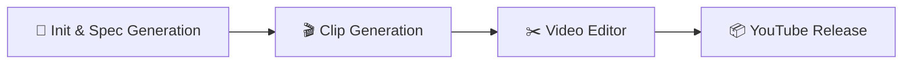

# 🚀 yt-automation-engine (v2.0)

> **Autonomous Single-Channel Stock-Video Production Engine**  
> Engineered for maximum viewer retention, algorithmic reach, and 100% cloud-native execution.

---

## 🌟 Overview & Golden Rule

`yt-automation-engine` v2.0 is an autonomous, sequential YouTube production pipeline built on the **"Pika Flow"** architecture. It transforms viral topic ideas into finished, scheduled YouTube Shorts (9:16) and Long-form (16:9) documentaries without human intervention.

> [!IMPORTANT]
> **GOLDEN RULE: ZERO LOCAL RUNS**  
> This engine is strictly cloud-native and executed **100% via GitHub Actions CI/CD**. There are no heavy local dependencies, no local disk consumption, and no local GPU requirements. The engine runs on scheduled cloud runners and terminates cleanly.

---

## ⚡ The 4-Stage "Pika Flow" Pipeline

The production pipeline is consolidated into a single master GitHub Actions workflow (`.github/workflows/master_pipeline.yml`) with modular, job-scoped dependencies for lightning-fast container startup:



### 1. `🚀 Init & Spec Generation` (Boot: ~5-10s)
* **Competitor Spy & Viral Detection:** Scans competitor channels (e.g. `@BrainBlud`, `@FactFiend`) for viral outliers with 24-hour quota caching.
* **Topic Sourcing & Fact-Checking Gate:** Pulls from Reddit (`r/todayilearned`, `r/Showerthoughts`, `r/psychology`) with datacenter Google Trends RSS fallbacks. Validates topics through an LLM scientific fact-checking gate to eliminate fake myths.
* **BrainBlud Scriptwriting Engine:** Drafts retention-engineered scripts featuring:
  * *In Media Res* hook openings.
  * *The Seamless Loop* (final sentence connects syntactically back into the opening hook).
  * Dynamic format weighting (80% Core BrainBlud / 20% Listicle).
* **Phonetic Normalization & TTS:** Translates symbols and numbers to spoken English (`125` $\rightarrow$ `one hundred and twenty-five`), streams Edge-TTS audio, and captures millisecond word-boundary timestamps.
* **Artifact:** Generates and uploads `output/spec.json`.

### 2. `🎬 Clip Generation` (Boot: ~2-3s)
* **100% Stock Video Architecture:** Zero AI image generation. Queries Pexels & Pixabay Video APIs for portrait (9:16) or landscape (16:9) clips.
* **CDN Link Expiry Protection:** Persists Provider Video IDs in manifest to auto-refresh download links if signed tokens expire.
* **Artifact:** Generates and uploads `output/clips_manifest.json`.

### 3. `✂️ Video Editor` (FFmpeg Native Assembly)
* **Aspect-Ratio Preserving Scaling:** Center-crop scaling (`force_original_aspect_ratio=increase,crop=1080:1920`) prevents stretched or distorted videos.
* **Kinetic Micro-Chunked Captions:** 1 to 3 words on screen at a time using *Anton* font, with the actively spoken word highlighted in Cyberpunk Yellow (`#FFFF00`).
* **Dynamic Transparent Watermark:** Burns in an elegant semi-transparent channel handle watermark (`opacity: 0.40`) in the `top_right` safe zone without cluttering the screen.
* **Pop-Free Audio Ducking:** Background music mixed at $-22\text{dB}$ ducks via a smooth 150ms exponential crossfade (`afade=t=out:d=0.15`) to absolute silence before punchline revelations.
* **Artifact:** Generates and uploads `output/final_render.mp4`.

### 4. `📦 YouTube Release` (One-Shot Smart Release)
* **Low-Quota Collision Detection:** Queries uploads playlist via a 1-unit low-quota check to identify occupied schedule slots.
* **Optimal Peak Scheduling:** Schedules video for the daily peak audience window (18:00 UTC). If already occupied, automatically increments $+24$ hours to the next day's peak slot.
* **One-Shot Upload (Zero Post-Edits):** Uploads video binary with finalized SEO metadata, category `27` (Education), and scheduled `publishAt` in a single API transaction. Never touches or edits the video post-upload to preserve algorithmic momentum.
* **Storage Pruning:** Automatically deletes the local video file upon upload confirmation to keep repository storage lean.

---

## 🛠️ Configuration & Customization

All operational settings are fully dynamic and zero-hardcoded:

### `config/channel_config.yaml`
```yaml
channel:
  name: "BrainBlud"
  handle: "@BrainBlud"
  niche: "psychology_and_facts"
  language: "en-US"
  voice:
    provider: "edge-tts"
    voice_id: "en-US-ChristopherNeural"
  branding:
    enabled: true
    watermark_text: "@BrainBlud"
    opacity: 0.40 # 40% subtle transparency
    position: "top_right" # Options: "top_right", "top_center", "above_title"
    font_size: 26
    font_family: "Montserrat-SemiBold"
  upload_defaults:
    privacy: "private"
    category_id: "27"
    made_for_kids: false
```

### `config/settings.yaml`
Controls video profiles for Shorts (`9:16`, `1080x1920`, 3.5s cuts) and Long-form (`16:9`, `1920x1080`, 6.0s cuts), competitor targets, audio levels, and API quotas.

### `memory/dynamic_weights.json`
Stores self-learning state (format probability ratios and cut intervals) autonomously tuned by performance analytics.

---

## 🔐 Required GitHub Secrets

Set these in your repository under **Settings ➔ Secrets and variables ➔ Actions**:

| Secret Name | Description |
|---|---|
| `YOUTUBE_CLIENT_ID` | Google Cloud OAuth 2.0 Client ID |
| `YOUTUBE_CLIENT_SECRET` | Google Cloud OAuth 2.0 Client Secret |
| `YOUTUBE_REFRESH_TOKEN` | Google Cloud OAuth 2.0 Refresh Token |
| `PEXELS_API_KEY` | Pexels API Key for stock videos |
| `PIXABAY_API_KEY` | Pixabay API Key for stock videos |
| `GROQ_API_KEY` | Primary LLM Provider (Llama 3.3 70B) |
| `GEMINI_API_KEY` | Secondary LLM Provider (Gemini 2.5 Flash) |
| `OPENAI_API_KEY` | Tertiary LLM Provider (GPT-4o-mini, optional) |
| `DISCORD_WEBHOOK` | Webhook URL for Pika Flow real-time stage cards |

---

## 🚀 Triggering Production

### Automated Daily Cron
The pipeline triggers automatically every morning at **08:00 UTC** via GitHub Actions.

### Manual Dispatch
1. Go to the **Actions** tab in your GitHub repository.
2. Select **Video Production Pipeline (v2.0)** on the left sidebar.
3. Click **Run workflow**, choose your video type (`short` or `long`), and confirm.